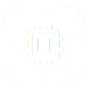

# [MemStore](https://memstore.vercel.app/)

MemStore is an ultimate component inventory management system for makers, engineers, and hobbyists. It allows you to manage your components, track their quantities, and easily find them when you need them. This project is built with Vite, Vue, Boxicons, and Tailwind CSS, it uses Firebase for authentication and Firestore for data storage.

## Features
- **Component Management**: Add, edit, and delete components with ease.
- **Inventory Tracking**: Keep track of your components' quantities and statuses.
- **Search**: Quickly find components using search.
- **Categories**: Organize components into categories for better management.
- **Authentication**: Secure your data with user authentication.
- **Responsive Design**: Use MemStore on any device, from desktop to mobile.

## Roadmap
- [x] Add component management features
- [x] Implement inventory tracking
- [x] Add search functionality
- [x] Implement categories for components
- [x] Add user authentication
- [ ] Implement dark mode
- [ ] Add export/import functionality
- [ ] Improve UI/UX
- [ ] Add more component types
- [ ] Implement notifications for low stock

## Contributing
Contributions are welcome! Please [open issues](https://github.com/leecheeyong/memstore/issues) or [pull requests](https://github.com/leecheeyong/memstore/pulls) for improvements and bug fixes.

## License
This project is licensed under the MIT License. See the [LICENSE](./LICENSE) file for details.
